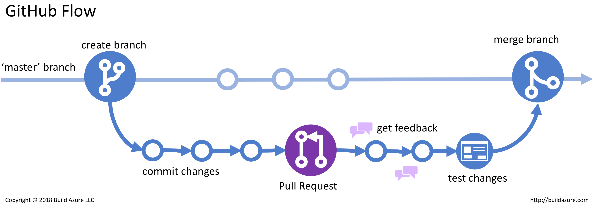

# Клиника

[User Story Map](https://miro.com/app/board/o9J_l4NGSwo=/)

## Описание CI/CD

Для ветвления используем github flow

- Продакшен сервер находится на Amazon EKS on Fargate
- Выкатка на продакшен происходит по коммиту в main
- Описание action [Deploy to Amazon ECS](https://github.com/stringconcat/enterprise_dev_course/actions/workflows/aws%20production%20deploy.yml)

## Запуск

- Для запуска локально запустить скрипт run.sh
- Открыть http://localhost:8080/hello

